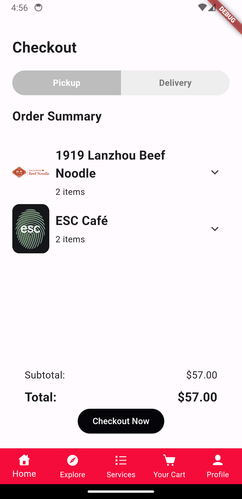

# Project Name - Mobile App Development - Implementation - Deliverable 2 (MQGO App)
# Student Id - 47833440
# Student Name - Shenuka Nimshan Gunathilake Mestiyage Don

## 01. Brief Description of Project

The MQGO (Your all in one Macquarie experience) app stands as the pinnacle of convenience and efficiency, revolutionizing the university journey for students and staff alike. Crafted with meticulous attention to detail, this comprehensive tool seamlessly integrates into daily campus life, offering a plethora of features designed to elevate every aspect of the Macquarie experience.

From effortlessly navigating campus events to indulging in culinary delights through hassle-free food and beverage orders, the app caters to every need. Need a parking spot? Simply book one with ease. Craving a quiet space for study? Reserve a library study nook with a few taps. Plus, with access to top-notch gym and aquatic services, staying fit and healthy has never been more convenient.

But that's not all - the app also boasts a responsive chatbot, ready to provide instant assistance whenever needed. With customizable profiles and the option to switch between dark and light themes, personalization is at the forefront of the user experience. Say goodbye to the hassle of juggling multiple platforms - MQGO streamlines it all into one sleek, user-friendly interface, ensuring that every interaction is as smooth and tailored as possible. Experience the future of university life with MQGO - where convenience, efficiency, and personalization converge to redefine the Macquarie experience.

## 02. How the App Works

https://github.com/MQCOMP3130-2024/comp3130-major-work-ShenukaGunathilake/assets/126541721/4e205a2e-5135-4a13-b860-d472f92c5918

## Tech Stack

### Mobile App Development

- **Flutter:** The app is built using Flutter, a cross-platform framework that ensures consistent performance and user experience across Android and iOS platforms.


### Backend Services

- **Firebase:** The backend of the app utilizes Firebase, providing real-time updates and ensuring scalability and reliability for user authentication, data storage, and other functionalities. Used resources,
<ul>
  <li>
    Firebase Authentication
  </li>
  <li>
    Firestore Database
  </li>
  <li>
    App Check
  </li>
  <li>
    Firebase Storage
  </li>
  <li>
    Analytics
  </li>
</ul>


## Why Firebase?

- **Real-Time Updates:** Firebase's real-time database and cloud messaging services enable instant updates and notifications, enhancing the app's interactivity and responsiveness.
  
- **Scalability and Reliability:** Firebase's scalable infrastructure ensures reliable performance even as user traffic grows, providing a robust backend solution.

## 03. Design Differences from Deliverable 1

The design of the MQGO app differs from Deliverable 1 by incorporating five main screens: Home, Explore, Services, Cart, and Profile. Each service features its own dedicated screen for enhanced usability. The navigation and user interfaces have been refined to provide a smoother user experience.

<ul>
  <li>
    <b>Improved Password Recovery:</b> Now includes a "Forgot Password" screen with email verification.
  </li>
  <li>
   <b>Streamlined Authentication:</b> Unnecessary buttons have been removed from the login and signup screens, with the addition of Google and Apple sign-in options.
  </li>
  <li>
    <b>Simplified Onboarding:</b> Eliminated unnecessary screens like the "Getting Started" screen to streamline user access to the app.
  </li>
  <li>
    <b>Enhanced Cart Experience:</b> The cart screen's UI has been improved, allowing users to easily edit items.
  </li>
  <li>
    <b>Branding Enhancements:</b> Added a splash screen and app icon for better app recognition.
  </li>
  <li>
    <b>Enhanced User Feedback:</b> Implemented form validations and alerts for improved user guidance.
  </li>
  <li>
    <b>Optimized User Verification:</b> Removed the OTP mobile verification process from the UI for a smoother user journey.
  </li>
  <li>
    <b>Added "Ask MQ" Feature:</b> Introduced a new screen to ask questions directly, supported by a newly integrated chatbot.
  </li>
</ul>


## 04. Devices Used for Development and Testing

The MQGO app has been developed and tested on Android devices and web view (Chrome) to ensure compatibility and optimal performance across platforms.

## 05. Additional Information

Please find attached images for Firebase collection page and GitHub contribution history to evaluate the project's folder structure and development progress effectively.

#### Firebase


#### Github Contribution


#### Folder Structure


#### Used Dependencies


## 06. Screens

#### Splash Screens


#### Sign In


#### Sign Up


#### Forgot Password


#### Home


#### Explore


#### Services


#### Restaurants


#### Restaurant Detail


#### Parking Space


#### Ask MQ Chat


#### Gym Space


#### Aquatic Space


#### Study Space


#### Cart


#### Checkout



#### Reservation Order History


#### Account


## 07. Test Cases
Tests include unit testing and widget testing as well.


#### custom_bottom_navigation_bar_test.dart
```
import 'package:flutter/material.dart';
import 'package:flutter_test/flutter_test.dart';
import 'package:mqgo_app/widgets/bottom_navigation_bar.dart';

void main() {
  testWidgets('Widget Renders Correctly', (WidgetTester tester) async {
    await tester.pumpWidget(MaterialApp(
      home: CustomBottomNavigationBar(
        currentIndex: 0,
        onTap: (index) {},
      ),
    ));

    expect(find.text('Home'), findsOneWidget);
    expect(find.text('Explore'), findsOneWidget);
    expect(find.text('Services'), findsOneWidget);
    expect(find.text('Your Cart'), findsOneWidget);
    expect(find.text('Profile'), findsOneWidget);
  });

  testWidgets('Initial State Test', (WidgetTester tester) async {
    await tester.pumpWidget(MaterialApp(
      home: CustomBottomNavigationBar(
        currentIndex: 2, // Example currentIndex
        onTap: (index) {},
      ),
    ));

    expect(find.byType(BottomNavigationBar), findsOneWidget);
    expect(find.text('Services'),
        findsOneWidget); // Assuming currentIndex is set to 2
  });

  testWidgets('Tap Functionality Test', (WidgetTester tester) async {
    int tappedIndex = -1;

    await tester.pumpWidget(MaterialApp(
      home: CustomBottomNavigationBar(
        currentIndex: 0,
        onTap: (index) {
          tappedIndex = index;
        },
      ),
    ));

    await tester.tap(find.text('Services')); // Tap on a specific item
    expect(tappedIndex, 2); // Assuming Services item has index 2
  });

  testWidgets('Navigation Bar Items Text Test', (WidgetTester tester) async {
    await tester.pumpWidget(MaterialApp(
      home: CustomBottomNavigationBar(
        currentIndex: 0,
        onTap: (index) {},
      ),
    ));

    expect(find.text('Home'), findsOneWidget);
    expect(find.text('Explore'), findsOneWidget);
    expect(find.text('Services'), findsOneWidget);
    expect(find.text('Your Cart'), findsOneWidget);
    expect(find.text('Profile'), findsOneWidget);
  });

  testWidgets('Tap Functionality Changes Index Test',
      (WidgetTester tester) async {
    int tappedIndex = -1;

    await tester.pumpWidget(MaterialApp(
      home: CustomBottomNavigationBar(
        currentIndex: 0,
        onTap: (index) {
          tappedIndex = index;
        },
      ),
    ));

    await tester.tap(find.text('Your Cart')); // Tap on a specific item
    expect(tappedIndex, 3); // Assuming Your Cart item has index 3
  });

  testWidgets('Tap Functionality Callback Test', (WidgetTester tester) async {
    int tappedIndex = -1;

    await tester.pumpWidget(MaterialApp(
      home: CustomBottomNavigationBar(
        currentIndex: 0,
        onTap: (index) {
          tappedIndex = index;
        },
      ),
    ));

    await tester.tap(find.text('Profile')); // Tap on a specific item
    expect(tappedIndex, 4); // Assuming Profile item has index 4
  });

  testWidgets('Current Index Test', (WidgetTester tester) async {
    await tester.pumpWidget(MaterialApp(
      home: CustomBottomNavigationBar(
        currentIndex: 2,
        onTap: (index) {},
      ),
    ));

    expect(find.text('Services'), findsOneWidget);
  });

  testWidgets('Tap Functionality Callback Test', (WidgetTester tester) async {
    int tappedIndex = -1;

    await tester.pumpWidget(MaterialApp(
      home: CustomBottomNavigationBar(
        currentIndex: 0,
        onTap: (index) {
          tappedIndex = index;
        },
      ),
    ));

    await tester.tap(find.text('Profile')); // Tap on a specific item
    expect(tappedIndex, 4); // Assuming Profile item has index 4
  });

  testWidgets('Current Index Test', (WidgetTester tester) async {
    await tester.pumpWidget(MaterialApp(
      home: CustomBottomNavigationBar(
        currentIndex: 2,
        onTap: (index) {},
      ),
    ));

    expect(find.text('Services'), findsOneWidget);
  });

  testWidgets('Correct Navigation Index Test', (WidgetTester tester) async {
    int selectedIndex = -1;

    await tester.pumpWidget(MaterialApp(
      home: CustomBottomNavigationBar(
        currentIndex: 0,
        onTap: (index) {
          selectedIndex = index;
        },
      ),
    ));

    await tester.tap(find.text('Explore')); // Tap on a specific item
    expect(selectedIndex, 1); // Assuming Explore item has index 1
  });
}
```

#### parking_space_test.dart
```
import 'package:cloud_firestore/cloud_firestore.dart';
import 'package:flutter/material.dart';
import 'package:flutter_test/flutter_test.dart';
import 'package:mqgo_app/widgets/space_booking_history.dart'; // assuming this is where your buildParkingHistory function resides

void main() {
  testWidgets('Widget Renders Correctly', (WidgetTester tester) async {
    await tester.pumpWidget(MaterialApp(
      home: Builder(
        builder: (context) {
          return buildParkingHistory(context);
        },
      ),
    ));

    expect(find.text('Booking No:'), findsOneWidget);
    expect(find.text('No bookings found.'), findsNothing);
    expect(find.byType(CircularProgressIndicator), findsNothing);
  });

  testWidgets('Widget Shows No Bookings Message', (WidgetTester tester) async {
    await tester.pumpWidget(MaterialApp(
      home: Builder(
        builder: (context) {
          return buildParkingHistory(context);
        },
      ),
    ));

    expect(find.text('No bookings found.'), findsOneWidget);
    expect(find.text('Booking No:'), findsNothing);
    expect(find.byType(CircularProgressIndicator), findsNothing);
  });

  testWidgets('Widget Shows Loading Indicator', (WidgetTester tester) async {
    await tester.pumpWidget(MaterialApp(
      home: Builder(
        builder: (context) {
          return buildParkingHistory(context);
        },
      ),
    ));

    expect(find.byType(CircularProgressIndicator), findsOneWidget);
    expect(find.text('Booking No:'), findsNothing);
    expect(find.text('No bookings found.'), findsNothing);
  });

  testWidgets('Widget Shows Error Message', (WidgetTester tester) async {
    await tester.pumpWidget(MaterialApp(
      home: Builder(
        builder: (context) {
          return StreamBuilder<QuerySnapshot>(
            stream: null,
            builder: (context, snapshot) {
              return buildParkingHistory(context);
            },
          );
        },
      ),
    ));

    expect(find.text('Error:'), findsOneWidget);
    expect(find.byType(CircularProgressIndicator), findsNothing);
    expect(find.text('Booking No:'), findsNothing);
    expect(find.text('No bookings found.'), findsNothing);
  });
}
```

#### restaurant_order_history_test.dart
```
import 'package:flutter/material.dart';
import 'package:flutter_test/flutter_test.dart';
import 'package:cloud_firestore/cloud_firestore.dart';
import 'package:firebase_core/firebase_core.dart';
import 'package:flutter/foundation.dart';
import 'package:firebase_app_check/firebase_app_check.dart';
import 'package:mqgo_app/widgets/order_history.dart';

void main() {
  // Initialize Firebase before running tests
  setUpAll(() async {
    WidgetsFlutterBinding.ensureInitialized();
    await Firebase.initializeApp();

    await FirebaseAppCheck.instance.activate();
  });

  testWidgets('Widget Renders Correctly', (WidgetTester tester) async {
    await tester.pumpWidget(MaterialApp(
      home: Builder(
        builder: (context) => buildTestWidget(context),
      ),
    ));

    expect(find.text('Order No:'), findsOneWidget);
    expect(find.text('No orders found.'), findsNothing);
    expect(find.byType(CircularProgressIndicator), findsNothing);
  });

  testWidgets('Widget Shows No Orders Message', (WidgetTester tester) async {
    await tester.pumpWidget(MaterialApp(
      home: Builder(
        builder: (context) => buildTestWidget(context),
      ),
    ));

    expect(find.text('No orders found.'), findsOneWidget);
    expect(find.text('Order No:'), findsNothing);
    expect(find.byType(CircularProgressIndicator), findsNothing);
  });

  testWidgets('Widget Shows Loading Indicator', (WidgetTester tester) async {
    await tester.pumpWidget(MaterialApp(
      home: Builder(
        builder: (context) => buildTestWidget(context),
      ),
    ));

    expect(find.byType(CircularProgressIndicator), findsOneWidget);
    expect(find.text('Order No:'), findsNothing);
    expect(find.text('No orders found.'), findsNothing);
  });

  testWidgets('Widget Shows Error Message', (WidgetTester tester) async {
    await tester.pumpWidget(MaterialApp(
      home: Builder(
        builder: (context) => buildTestErrorWidget(context),
      ),
    ));

    expect(find.text('Error:'), findsOneWidget);
    expect(find.byType(CircularProgressIndicator), findsNothing);
    expect(find.text('Order No:'), findsNothing);
    expect(find.text('No orders found.'), findsNothing);
  });
}

Widget buildTestWidget(BuildContext context) {
  return buildOrderHistory(context);
}

Widget buildTestErrorWidget(BuildContext context) {
  // Providing an empty stream to simulate an error
  final Stream<QuerySnapshot> errorStream = Stream.empty();

  return StreamBuilder<QuerySnapshot>(
    stream: errorStream,
    builder: (context, snapshot) {
      if (snapshot.hasError) {
        // Use debugPrint to print the error only during debugging
        debugPrint('Error: ${snapshot.error}');
        // Returning an empty container to hide the error message during tests
        return Container();
      }
      // Returning the order history widget even in error case for consistency
      return buildOrderHistory(context);
    },
  );
}
```


"# MQGO-App" 
